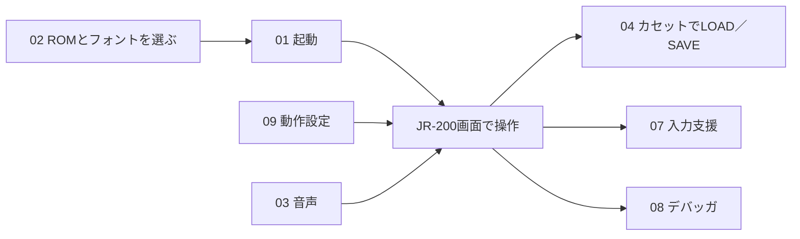
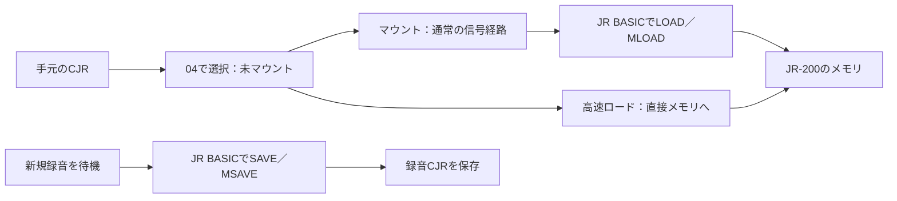
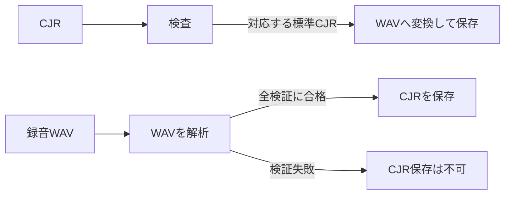

# 画面の機能ガイド

JR-200 Web Emulatorをローカルのブラウザで使うためのガイドです。画面の番号（01〜09）に沿って、各機能の目的、操作、結果を説明します。ビルドとROMの用意は[README](../README.md)を参照してください。

Windows版VJR-200のキー操作やJR-200固有の機能は[公式マニュアル](https://find-jr200.github.io/vjr200_man.html)も参考になります。Web版のボタン配置、ファイルの扱い、保存方法はこのガイドを優先してください。[Windows版との機能対応表](WINDOWS_PARITY.md)には、移植済み・保留中の機能を分けて記録しています。

## まず何を使う？

| したいこと | 開く場所 | 操作後に確認すること |
|---|---|---|
| JR-200を起動する | 02 起動データ → 01 JR-200を操作 | 「起動データ」にROMとフォントの名前、01に実行中の状態が表示される |
| キーボードやゲームパッドで操作する | 01 JR-200を操作、09 動作設定 | 画面にフォーカスがあり、入力モードや1P／2Pの表示が期待どおりになる |
| CJRをJR BASICから読む／保存する | 04 カセット | 選択中とマウント済みの表示が一致し、ロード中に信号位置が進む |
| CJRやWAVを調べて変換する | 05 検査と変換、06 標準CJRを作成 | 検査結果と保存ボタンの有効／無効を確認する |
| テキストを入力する | 07 入力支援 | 入力中のバイト数と完了表示を確認する |
| 動作を調べる | 08 デバッガ | 停止理由、レジスタ、履歴を確認する |

## 01 JR-200を操作

中央の320×224画面には、文字などを表示する256×192の領域と、その外側のTV外周色が含まれます。「起動」で選択済みROMから開始し、「一時停止／再開」でCPUを止めたり戻したりします。「リセット」は同じROM・フォントを保持したまま本体を初期化します。

物理キーボードを使う前にJR-200画面をクリックしてください。「仮想キー」は補助用で、既定では閉じています。BREAK、INS／DEL、十字配置のカーソルキーも表示できます。「全画面」はボタンまたは画面にフォーカスがあるときの`Alt+Enter`で切り替えます。

仮想キーボードのCTRLは次の1キーに適用します。物理キーボードは`Ctrl`を押しながら入力します。JR BASICの入力待ちでは、例えば`Ctrl+A`で`AUTO`、`Ctrl+3`で`SAVE`の入力になります。カナモード中のローマ字変換は07で設定します。

別のタブへ移ると押しっぱなしのキーは解放されます。CPUの実行は既定で続きます。タブ切替時に止めたい場合は09の「自動で一時停止」をONにします。ブラウザ自体が非表示タブの処理を間引く場合があります。

## 02 起動データ（ROM・フォント）

| 操作 | 使い方と結果 |
|---|---|
| 結合ROM | ROM1→ROM2の順に連結した16,384バイトを1ファイルで選ぶ |
| ROM1／ROM2を別々に選択 | 各8,192バイトを別々に選ぶ。結合ROMと同時には使わない |
| フォント | 2,048バイトのファイルを選ぶ |
| このブラウザへの保存と自動復元を許可 | 許可した場合だけIndexedDBへ保存し、同じURLで次回開いたときに復元する |
| 保存済みファイルを復元／削除 | 手動で復元する、またはブラウザ内の保存済みデータを消す |

ブラウザは安全上、再訪時のファイル選択欄を空にします。復元状態と最後に読み込んだファイル名は「起動データ」の表示で確認してください。`127.0.0.1`と`localhost`、ポート違い、プライベートウィンドウは別の保存領域です。選択したファイルは外部へ送信しません。

## 03 音声

本体音声は初回ONです。ブラウザの自動再生制限があるため、最初の「起動」などの操作で音声デバイスを開始します。停止後は上部の「音声を有効化」（状態によっては「音声を開始」）で再開し、03の「音声を停止」で出力を止めます。音量は初回20%、上限50%で、ミュートは音量設定を残して無音にします。ON/OFF・音量・ミュートは次回起動時も引き継ぎます。

本体音声には3チャンネル音源とキークリックが含まれます。キークリックのブラウザ出力は既定OFFで、03の「キークリック音」でONにできます。ONにした後も本体側のPB6制御に従い、JR BASICの`POKE 0,0`でOFF、`POKE 0,64`でONになります。カセット信号のモニター音は04で別にON/OFFと音量を設定します。音が出ないときは03の状態欄でWeb Audioの状態とミュートを確認してください。

## 04 カセット（CJRの通常ロード／セーブ）

Wikiなどの作品別 `?game=<id>` リンクから開いた場合、公開済みCJRが検証後に通常の
カセット入力へ自動マウントされます。画面上部の作品名と「マウント済み」を確認してから、
ROM・フォントで起動し、以下の`MLOAD`と作品ごとの実行コマンドを入力してください。
このリンクはROMやフォントの自動取得、CJRの自動実行ではありません。
[作品IDリンクの配布条件](GAME_LINKS.md)も参照してください。

CJRを選んだだけではJR-200にセットされません。「選択中: …（未マウント）」を確認してから「マウント」を押します。表示が「マウント済み」に変わったら、JR BASICでBASIC形式は`LOAD`、マシン語形式は`MLOAD`を入力します。

「高速ロード」は読み込み待ちを省く便宜機能です。カセット信号を通ったLOAD／MLOADの成功確認には使えません。「巻戻し」は同じCJRを先頭からやり直すとき、「取出し」はマウントを解除するときに使います。「録音CJRを再生へマウント」は直前に録音したCJRをそのまま読み込み側へ移します。

「LOAD/MLOAD中のモニター音」は既定でON・25%です。信号を聞きながら読込み中に変更できます。本体音声自体を停止していると出ません。

マシン語CJRには実行開始アドレスの情報がありません。`MLOAD`後の起動方法は各プログラムの説明に従ってください。先頭ロードアドレスから自動実行する機能はありません。

## 05 検査と変換（CJR・WAV）

「CJRファイル」で内容、形式、速度、ブロックを検査します。標準CJRでない「ヘッダーなし形式」は、利用者が明示的に許可した場合だけ検査できます。検査はJR-200でのロードとは別です。

CJRから作るWAVは44.1または48 kHz、モノラル16-bitで、データ速度は600／2,400 baudを選べます。WAVからの復元は、対応するPCM形式かを調べ、全ブロックとチェックサムに合格したときだけCJRの保存を許可します。ブラウザの入力上限は8 MiBです。生成WAVを物理JR-200で読み込む往復検証は未実施です。

## 06 標準CJRを作成（BINから）

既存のBINファイルを、指定したJRファイル名・開始アドレス・形式・ボーレートで標準CJRに格納します。マシン語形式ではBINの配置先アドレスを指定します。BASIC形式はJR-200用のBASICバイト列を`$0801`から格納する用途で、普通のテキストをBASICへ変換する機能ではありません。CJRを作ったら05で検査できます。

## 07 入力支援

| 機能 | 使う場面 | 操作と注意 |
|---|---|---|
| クイックタイプ | 長いコマンドやプログラムを入力する | テキストを貼り、入力間隔を選んで「入力開始」。実行中は一時的にCPUが1,000%になる。「停止」、`Esc`、`F11`で中止 |
| マクロ（10件） | 繰り返す入力を保存する | スロットを選び、内容を保存して実行。`\r`はRETURN、`\\`は円記号／バックスラッシュ。ブラウザ内のlocalStorageへ保存 |
| ローマ字カナ | 物理キーボードからカナを入力する | ONにしてJR-200をカナモードにする。仮想キーは表示どおりのキーを直接入力し、変換しない |

## 08 デバッガ

| 操作 | 何が分かるか |
|---|---|
| 実行／再開・一時停止・1命令step | CPUを進める、止める、1命令だけ実行する |
| ブレークポイント | 指定アドレスの命令を実行する直前に止める |
| watchpoint | 指定メモリアドレスのCPU読出し／書込みを検出して止める |
| レジスタ・履歴 | 停止理由、PCなどの値、直近の命令・メモリアクセスを調べる |
| メモリpeek・dump.bin | 最大256バイトを画面に表示、または全64 KiBをファイルに保存する |

履歴は明示的にONにした場合だけ記録します。メモリpeekはI/O読出しの副作用を起こしません。メモリダンプには実行中のROMや読み込んだプログラムの内容が含まれ得るため、公開・共有前に中身を確認してください。

## 09 動作設定

| 設定 | 変わること |
|---|---|
| 別タブ移動時の自動一時停止 | 既定はOFF。ONにするとフォーカスを失ったときCPUを停止 |
| 画面倍率・画素比・回転・スムージング | 画面の大きさと見え方を変更。通常は自動倍率・正方形画素・0度・補間なし |
| CPU速度 | 50〜1,000%。音声の再生速度も追従 |
| LOAD/MLOAD中は1,000% | 通常の再生信号経路を保ったまま、読込み待ちを短縮 |
| RAM拡張1／2・初期化パターン | メモリ配置を変更。次の起動またはリセットで反映 |
| ジョイスティックのA/B番号・1ボタン互換 | ゲームパッドのボタン割当を変更 |
| 1P強制ジョイスティック | 1Pの方向をカーソルキー、A/Bを指定JRキーコードとして入力 |

接続中のゲームパッドが1台なら、ブラウザのGamepad番号に関係なく1Pです。2台なら1台目が1P、2台目が2Pです。1Pを抜いて1台だけ残った場合、その機器は1Pへ移ります。

画面・動作・音声・カセットモニター・入力支援・ゲームパッド・変換フォーム・デバッガの履歴記録ON/OFFは、同じURLを同じブラウザで次回開いたとき前回値を復元します。WAVのボーレートは、新しいCJRを選んだ時点ではそのCJRの元の速度に合わせ、変換したい場合だけ選び直してください。ファイル選択、マウント、録音・一時停止などの作業状態、ブレークポイント・ウォッチポイントは復元しません。「ヘッダーなし形式を明示的に許可」も毎回OFFに戻します。ROMとフォントは別途、保存を明示許可した場合だけ復元します。ブラウザの保存領域を消した場合や保存が使えない場合は初回値に戻ります。

物理USB／Bluetooth機器ごとの互換性は未検証です。反応しない場合は一度ボタンを押してブラウザに認識させ、09の接続表示とA/B番号を確認してください。

## 使う前に確認したい境界

- ROM、フォント、商用ソフト、録音は配布していません。本人が利用権を確認したファイルをローカルで選択してください。
- `file://`からHTMLを直接開かず、[READMEの手順](../README.md#ブラウザで起動する)でローカルサーバーから開いてください。
- CJRの検査、ブラウザでのLOAD/MLOAD、WAVのデジタル復号、物理JR-200でのWAV往復は、それぞれ別の確認です。[現在の検証範囲](STATUS.md)を参照してください。
